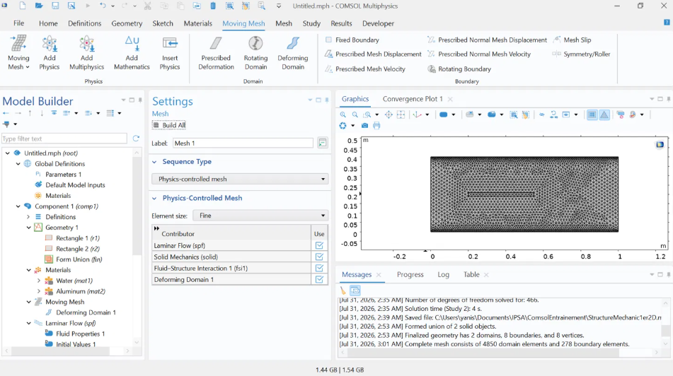
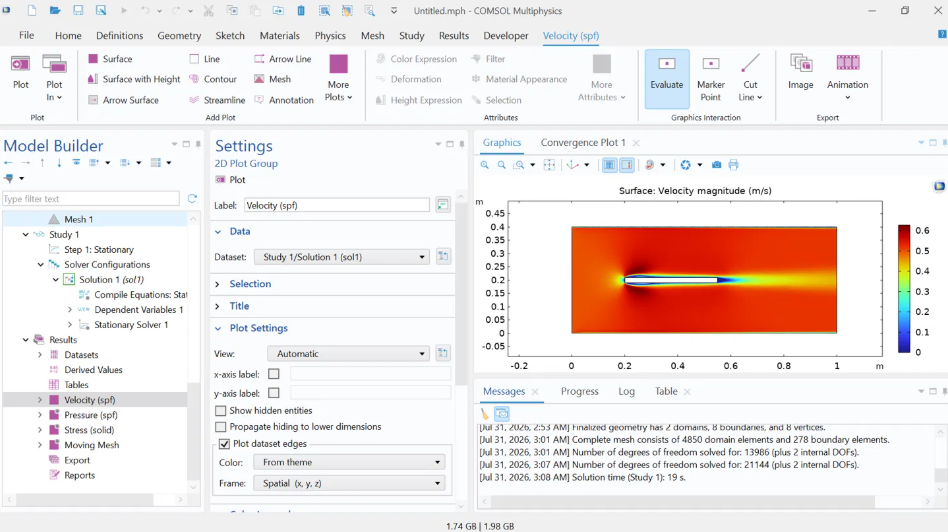
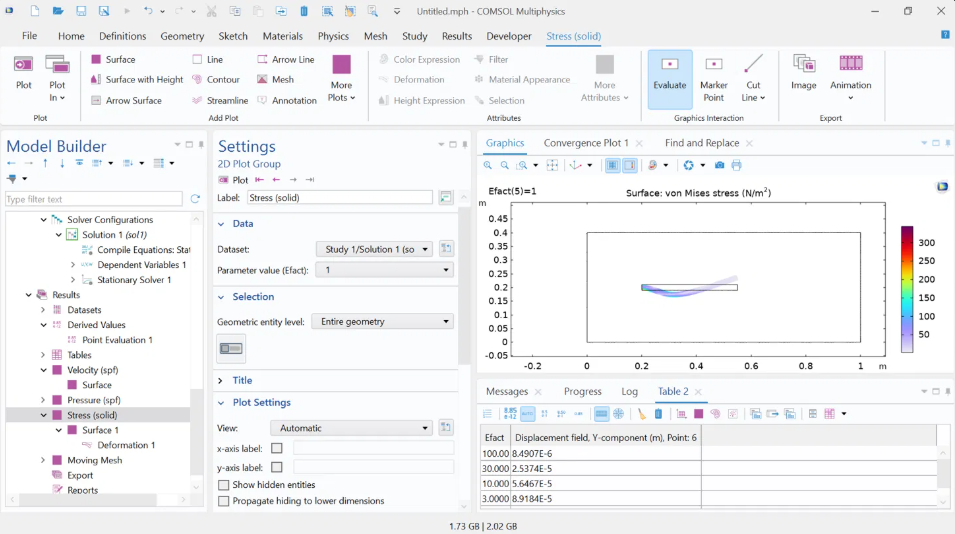

# Fluid-Structure Interaction — Flexible Beam in Cross-Flow (COMSOL)

Self-taught COMSOL Multiphysics project: two-way fluid-structure coupling (FSI) of a flexible beam immersed in a laminar channel flow, with a moving mesh (ALE) to capture the bidirectional feedback between fluid and structure.

**Module:** Fluid-Structure Interaction (Laminar Flow + Solid Mechanics + Moving Mesh)
**Context:** Part of a self-directed COMSOL learning program (after CFD/Heat Transfer and Structural Mechanics modules), ahead of moving to 3D.

## Objective

Couple two distinct physics with two-way feedback for the first time: a flow that deforms a structure, and a deformed structure that in turn modifies the fluid domain (via a moving mesh, ALE). The case is inspired by the academic Turek-Hron benchmark (flexible flag in cross-flow).

## Model

- 2D channel (1 m × 0.4 m) filled with water, laminar flow (inlet U₀ = 0.5 m/s)
- Flexible beam, clamped to a wall, immersed in the flow (0.35 × 0.02 m)
- Interface: **Fluid-Solid Interaction** (with Moving Mesh active — not the Fixed Geometry variant)

*Channel + clamped beam geometry, with refined mesh around the beam*

## Challenges encountered & diagnostics

### 1. Cross-material domain selection error
First compute failed: `Undefined material property 'mu' required by Fluid Properties`. Diagnostic: the fluid domain had inherited the solid material (aluminum, no viscosity) by default. Fix: manually restricted each material to its own domain (**Manual** selection).

### 2. Beam too stiff for a visible effect
With standard aluminum, resulting displacement: **1.45×10⁻⁸ m** — completely negligible relative to the model's scale. Fixed by replacing it with a custom soft material (Young's modulus E = 1 MPa, ν = 0.45, ρ = 1200 kg/m³ — typical of an elastomer).

### 3. Solver non-convergence (stiffness jump too abrupt)
Jumping directly to E = 1 MPa failed to converge (`Maximum number of segregated iterations reached`). Fixed with **parametric continuation**: introduced a factor **Efact** multiplying E, swept via Parametric Sweep from 100 (rigid) down to 1 (target), each step restarting from the previous solution. Convergence achieved across all 5 steps.

*Velocity magnitude field around the beam, converged solution — the deformed shape visibly disturbs the surrounding flow*

## Results

| Efact (stiffness factor) | Beam-tip Y-displacement (m) |
|---|---|
| 100 | 8.49×10⁻⁶ |
| 30 | 2.54×10⁻⁵ |
| 10 | 5.65×10⁻⁵ |
| 3 | 8.92×10⁻⁵ |
| 1 (target) | 7.28×10⁻⁵ |

### Non-linear effect observed — streamlining

Displacement grows with increasing flexibility up to Efact = 3, then **decreases slightly** between Efact = 3 and Efact = 1, even though the structure is softer still. Physical interpretation: at high flexibility, the beam no longer just bends — it **aligns itself with the flow**, reducing its effective frontal surface and therefore the force it experiences. This behavior (self-streamlining, analogous to a flag in the wind) is a purely non-linear effect that cannot be captured by a structure-only small-deformation calculation — it can only emerge from a full two-way FSI coupling.

*Von Mises stress field and deformed shape (scale factor ×500), Efact = 1 — the beam curves into an "S" shape, streamlined with the flow direction*

## Skills developed

- Fluid-Solid Interaction interface: automatic fluid/structure coupling with moving mesh (ALE)
- Diagnosing cross-domain material selection errors in multiphysics setups
- Defining and parameterizing a custom material (Blank Material)
- Parametric continuation technique to stabilize convergence of a strongly non-linear problem
- Identifying and interpreting a non-linear physical effect specific to two-way coupling (streamlining)
- Combined structure/fluid post-processing (scaled deformation, Von Mises stress)

## Conclusion

This project is a natural synthesis of the previous modules (CFD and Structural Mechanics), tackling a two-way multiphysics coupling with a moving mesh for the first time. Both roadblocks encountered (domain selection, non-convergence) were diagnosed and resolved using standard techniques in the field (selection restriction, parametric continuation), with the final result physically interpreted rather than simply obtained.

## Tools

`COMSOL Multiphysics` — Laminar Flow, Solid Mechanics, Moving Mesh (ALE), Fluid-Structure Interaction multiphysics coupling
